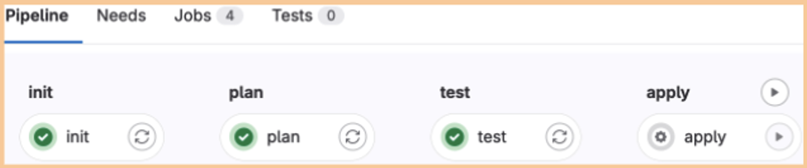

<blockquote>
Copyright Amazon.com, Inc. or its affiliates. All Rights Reserved.

Permission is hereby granted, free of charge, to any person obtaining a copy of this
software and associated documentation files (the "Software"), to deal in the Software
without restriction, including without limitation the rights to use, copy, modify,
merge, publish, distribute, sublicense, and/or sell copies of the Software, and to
permit persons to whom the Software is furnished to do so.

THE SOFTWARE IS PROVIDED "AS IS", WITHOUT WARRANTY OF ANY KIND, EXPRESS OR IMPLIED,
INCLUDING BUT NOT LIMITED TO THE WARRANTIES OF MERCHANTABILITY, FITNESS FOR A
PARTICULAR PURPOSE AND NONINFRINGEMENT. IN NO EVENT SHALL THE AUTHORS OR COPYRIGHT
HOLDERS BE LIABLE FOR ANY CLAIM, DAMAGES OR OTHER LIABILITY, WHETHER IN AN ACTION
OF CONTRACT, TORT OR OTHERWISE, ARISING FROM, OUT OF OR IN CONNECTION WITH THE
SOFTWARE OR THE USE OR OTHER DEALINGS IN THE SOFTWARE.
</blockquote>

# Setting Up Gitlab workflow

1. Read the project's root *README.md*, follow all of its guidelines and follow all steps in the **Deployment Steps** section.
2. This pipeline is built to run in a Linux container that has Terraform version >= 1.5 and Python version 3.

## Pipeline parameters

Used to control the workflow order and run any necessary pre-script installing.

### .gitlab-ci.yml
```
  TF_ROOT: "$CI_PROJECT_DIR/terraform"
  TF_PARAMS: "-var-file terraform.tfvars"
  PRIMARY_BRANCH: "main"
```
* **TF_ROOT** The location of the target project configuration.
* **TF_PARAMS** Parameters to be passed to `terraform init` and `terraform plan` stages. The `terraform apply` takes the configuration plan from the *plan* stage so it does not need parameters.
* **PRIMARY_BRANCH** The merge request target branch that will trigger the `terraform plan` pipeline when a merge request is created or updated, and the *terraform apply* pipeline after merging.

### Terraform.gitlab-ci.yml

Contains Terraform specific commands and actions.

```
variables:
  BUILD_IMAGE: "<build image uri>"
  TF_ROOT: "."
  TF_PARAMS: ${TF_PARAMS}
  PLAN: plan.cache
  PLAN_JSON: plan.json
```

* **BUILD_IMAGE** The image address that will be used to create the build container - needs Terraform >= 1.5 and Python 3 installed.
* **TF_ROOT** The default location of the target project configuration.
* **TF_PARAMS** The default parameters that will be passed to the `terraform init` and `terraform plan` commands.
* **PLAN** The name of the plan output from the `terraform plan` command. This does not need to be changed.
* **PLAN_JSON** The name of the JSON plan output from the `terraform plan` command. Can be delivered to reporting mechanism or MR. This does not need to be changed.

## Pipeline Stages


```
stages:
  - init
  - plan
  - test
  - apply
```


### init

* Executed for MR actions and when the **PRIMARY_BRANCH** is modified.
* Runs `terraform init`

### plan

* Executed for MR actions and when the **PRIMARY_BRANCH** is modified.
* Runs *resolve_permission_sets_and_assignments.py* to generate Terraform configuration files from the permission sets and principal assignment templates.
* Runs `terraform plan` and caches plan for subsequent `apply` stage

### test

**NOTE**: This stage is a test placeholder. The current test set is not sufficient for proper code coverage or security coverage; it does not contain any security tests or security guarantees.

* Executed for MR actions and when the **PRIMARY_BRANCH** is modified.
* Runs test through Python [pre-commit](https://pre-commit.com/) framework

### apply
* Executed  when the **PRIMARY_BRANCH** is modified. Manual intervention is needed to start this job.
* Runs `terraform apply` against terraform configurations stored in the repository and generated during the `plan` stage.
